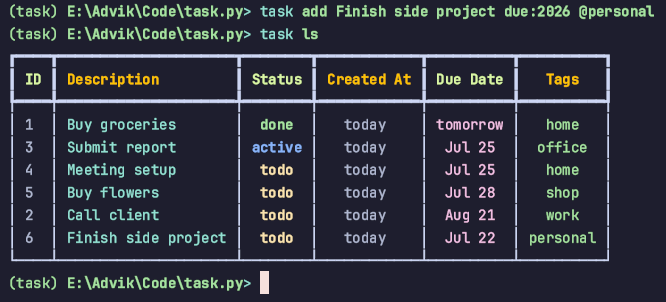

# Task.py
Manage your tasks. Anytime. Anywhere.



## Quickstart

### Installing

1. Install Task.py
```bash
uv tool install git+https://github.com/adv1k/task.py
```

### Developing Locally

1. Create venv
```bash
uv sync
# Activate the virtual environment based on your operating system:
# On Windows:
.venv\Scripts\activate
# On Linux/macOS:
source venv/bin/activate
```

2. Install Task.py in venv
```bash
uv pip install -e .
```

## Easy-to-Use Interface
Task.py is designed to be intuitive. Here are some common commands and examples to get you started:

### Get Help
To see a list of all available commands and their descriptions, use the help option:
```bash
task --help
```

### List All Tasks
View all your current tasks with their IDs, descriptions, and any associated details:
```bash
task ls
```

### Add Tasks Easily
Adding tasks is flexible, allowing you to specify due dates and contexts (e.g., `@home`, `@work`, `@office`, `@shop`).

- Add a task due tomorrow at home:
```bash
task add Buy groceries @home due:tomorrow
```

- Add a task due next Friday at home:
```bash
task add Meeting setup @home due:friday
```

- Add a task due on August 21st (current year assumed) at work:
```bash
task add Call client @work due:21aug
```

- Add a task due on a specific date at the office:
```bash
task add Submit report due:2025-07-25 @office
```

- Add a task due next Monday at the shop:
```bash
task add due:monday Buy flowers @shop
```

### Mark Tasks as Done
Once you've completed a task, you can mark it as done using its ID:
```bash
task done 1
```

### Remove Completed Tasks
To clear out all tasks that have been marked as done, use the clean command:
```bash
task clean
```

### Delete Any Task
If you need to permanently remove a task, use its ID with the del command:
```bash
task del 3
```

## Features
Task.py is built with a focus on extensibility, maintainability, and modern Python development practices:
- Easy to use: Clear and concise commands like add, ls, done, clean, and del, managing your tasks is straightforward and quick, requiring minimal learning curve.
- Plugin System: Task.py has a plugin system, allowing for easy integration with third-party services.
- Clean, Composable Code: The codebase is designed for clarity and modularity. Task.py stands on the shoulder of these giants:
    - Typer: For building the command-line interface, providing a clean and intuitive CLI.
    - Pydantic: For data validation, serialization and just making things straightforward.
- Type Hinting & Best Practices: The project extensively uses Python type hints for improved code readability, maintainability, and to catch potential errors early.


## Future
- Project Management
- Kanban
- Task Sync
- And much more...
